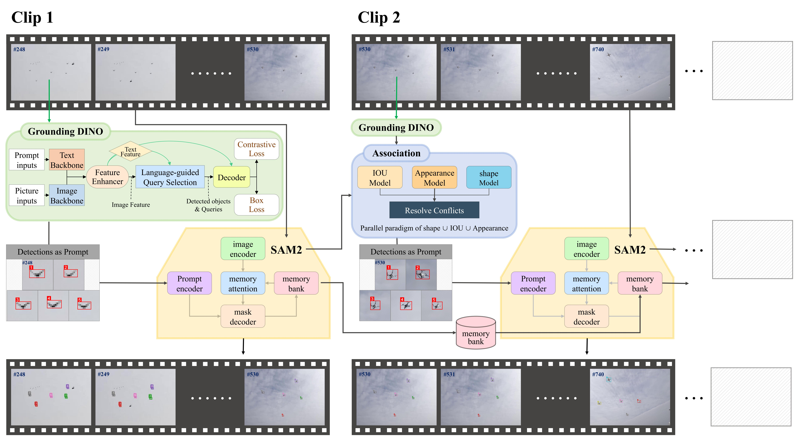

# SMOTracker：A SAM2-based Multiple Small-object Tracker

- (2025.08) We provide an initial version of our work.

## Abstract
Existing multi-object tracking (MOT) methods typically follow a tracking-by-detection paradigm with Kalman filters. Detected bounding boxes are fed into the Kalman filter’s observation equation to update tracklet locations, and similarity metrics are used to associate detections with tracklets. However, for small objects with low visual quality, detectors often fail to produce reliable results in consecutive frames or only yield low-confidence detections. Missing detections interrupt the observation update, and when the motion trajectories of small objects change, their tracks are prone to being lost. Camera zooming or movement further exacerbates this issue. To address these challenges, we propose SMOTracker, a SAM2-based multi-object tracker designed for small objects. Specifically, we replace the Kalman filter with the Segment Anything Model 2 (SAM2) and adopt a masklet-to-detection association strategy. Predicting object positions via SAM2 alleviates the limitations of Kalman filters, while assigning identities (IDs) to masklets instead of detections mitigates track loss under detection failures. Since SAM2 tracks objects sequentially, completing one object before starting another, and cannot be directly combined with detection-based approaches, we segment the video into multiple clips while maintaining a shared SAM2 memory bank. We further introduce cross-clip ID assignment by associating SAM2 masklets with detector outputs, enabling SMOTracker to operate effectively in an online streaming setting. Extensive experiments on multiple small-object tracking benchmarks demonstrate that SMOTracker achieves robust performance across diverse tracking scenarios.

### Model structure

https://github.com/user-attachments/assets/d680ea9a-3e0b-451a-9505-11e0abebbf4c

https://github.com/user-attachments/assets/c832a017-3f2b-4fea-9203-3c0622e1a220

https://github.com/user-attachments/assets/145433d5-7de0-4e37-97ac-1da309933971

## Tracking performance
### Results on 3 benchmark test datasets
#### Results of dataset DOHA Anti-UAV
| Method       | HOTA   | IDF1   | IDs  | IDSW | IDFN  |
|--------------|--------|--------|------|------|-------|
| DeepOCSORT   | 38.553 | 35.799 | 487  | 486  | 17262 |
| BoTSORT      | 39.386 | 39.326 | 847  | 827  | 17268 |
| StrongSORT   | 33.295 | 40.15  | 811  | 832  | 17268 |
| OCSORT       | 35.843 | 46.3   | 128  | 120  | 17262 |
| ByteTrack    | 38.223 | 49.156 | 147  | 139  | 17220 |
| Imprassoc    | 33.412 | 48.158 | 1459 | 1620 | 17250 |
| Boosttrack   | 11.215 | 7.629  | 67   | 48   | 22680 |
| Boosttrack++ | 13.127 | 8.569  | 75   | 54   | 22026 |
| G-SMOTracker | 61.109 | 65.685 | 48   | 36   | 6243  |
| Y-SMOTracker | 75.109 | 77.591 | 32   | 40   | 3957  |

#### Results of dataset Anti-UAV
| Method       | HOTA   | IDF1   | IDs  | IDSW | IDFN  |
|--------------|--------|--------|------|------|-------|
| DeepOCSORT   | 55.481 | 54.934 | 579  | 577  | 23229 |
| BoTSORT      | 54.981 | 52.957 | 652  | 656  | 23521 |
| StrongSORT   | 43.359 | 38.838 | 809  | 1004 | 30486 |
| OCSORT       | 52.060 | 49.696 | 713  | 729  | 26002 |
| ByteTrack    | 55.575 | 53.842 | 700  | 683  | 23138 |
| Imprassoc    | 39.971 | 31.895 | 1137 | 1181 | 33187 |
| Boosttrack   | 24.092 | 19.705 | 450  | 426  | 42202 |
| Boosttrack++ | 24.176 | 19.803 | 452  | 425  | 42157 |
| G-SMOTracker | 43.286 | 53.582 | 150  | 21   | 13038 |
| Y-SMOTracker | 61.578 | 81.571 | 84   | 33   | 7981  |

#### Results of dataset DUT Anti-UAV
| Method       | HOTA   | IDF1   | IDs | IDSW | IDFN  |
|--------------|--------|--------|-----|------|-------|
| DeepOCSORT   | 42.401 | 46.262 | 62  | 47   | 8171  |
| BoTSORT      | 40.822 | 41.737 | 60  | 45   | 8506  |
| StrongSORT   | 39.379 | 41.241 | 87  | 76   | 8686  |
| OCSORT       | 41.078 | 44.894 | 82  | 68   | 8437  |
| ByteTrack    | 39.934 | 41.128 | 76  | 63   | 8563  |
| Imprassoc    | 32.791 | 30.892 | 268 | 243  | 9720  |
| Boosttrack   | 12.698 | 9.4363 | 31  | 21   | 12428 |
| Boosttrack++ | 13.75  | 10.473 | 34  | 24   | 12345 |
| G-SMOTracker | 36.566 | 39.531 | 33  | 8    | 7557  |
| Y-SMOTracker | 53.098 | 55.931 | 32  | 16   | 5890  |

## Installation
[YOLO and test videos](https://drive.google.com/file/d/134OtEnjhvGCF06FPIHzIyElAAHSZEkPM/view?usp=sharing)

